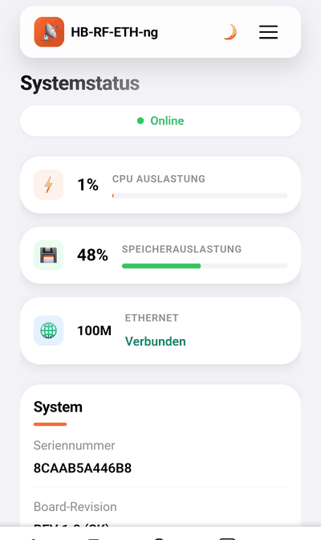
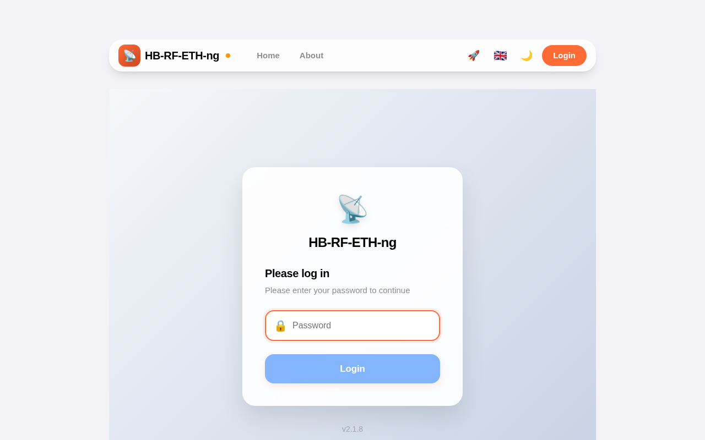
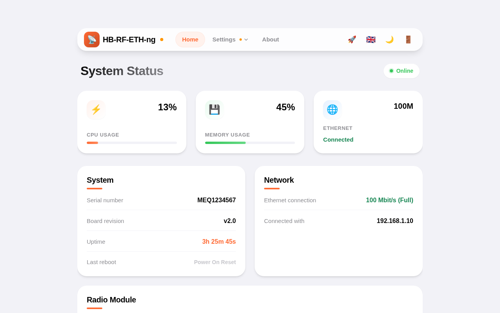
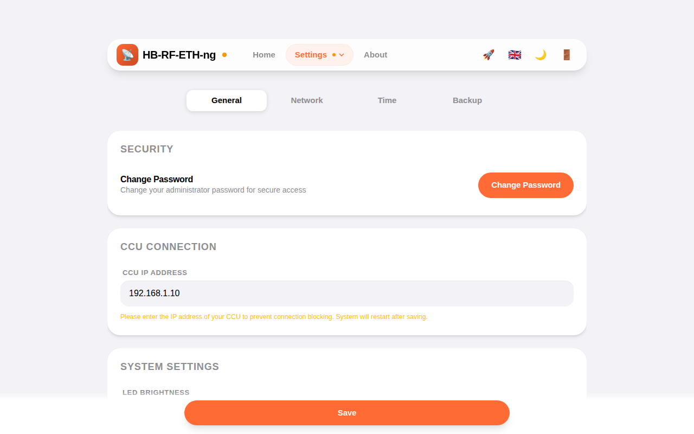
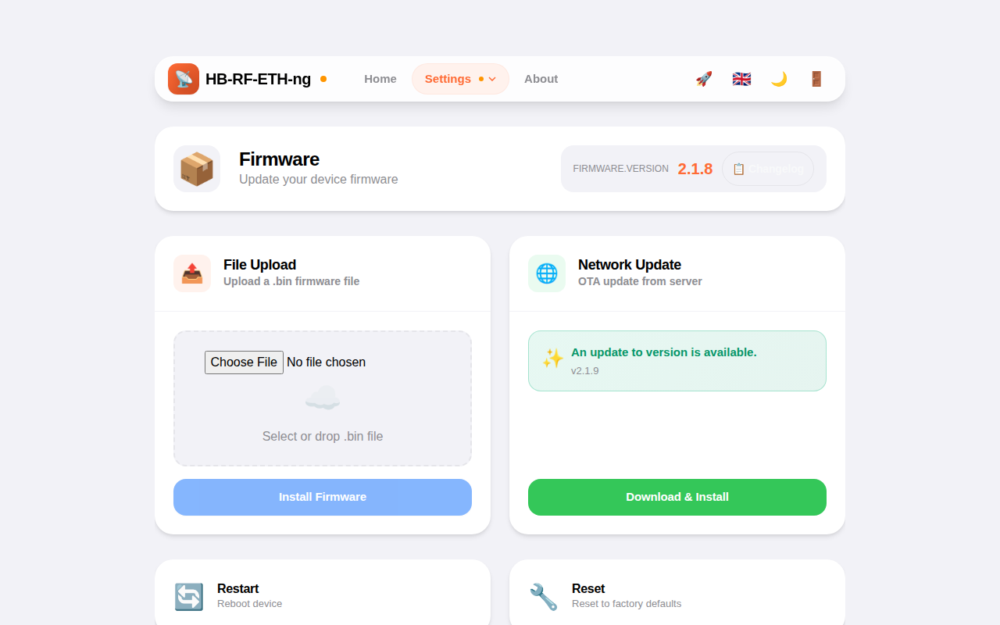
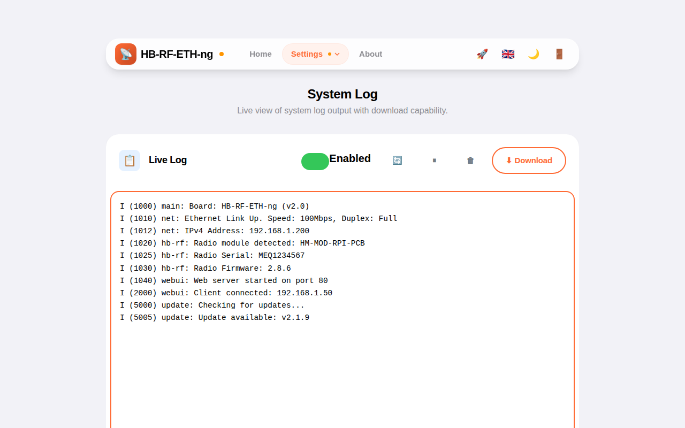
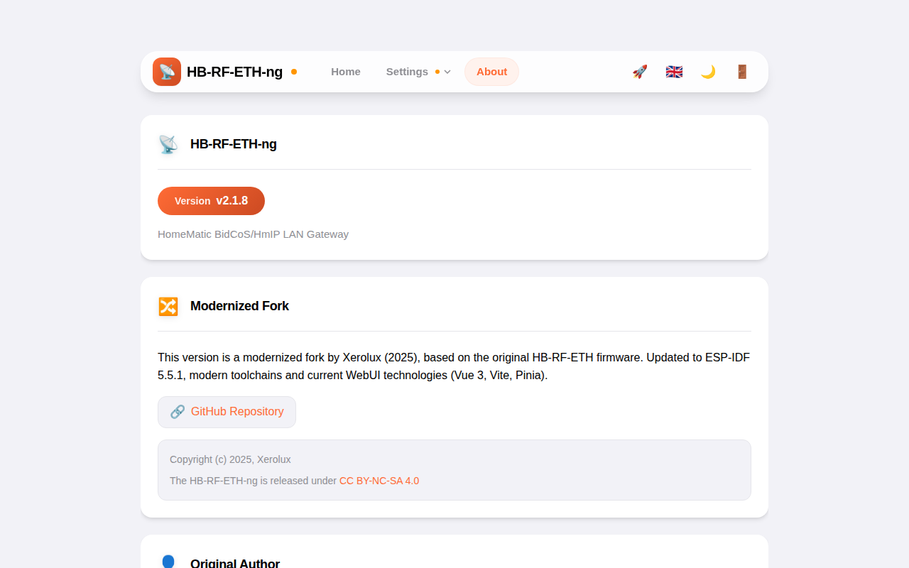
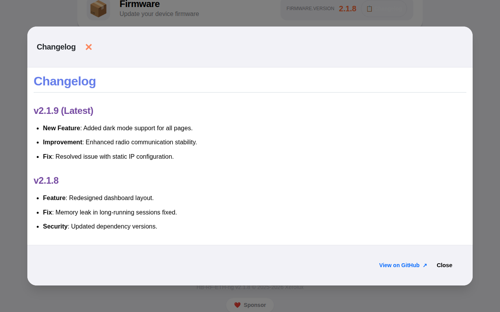

<div align="center">

# HB-RF-ETH-ng

**Modernisierte HomeMatic Netzwerk-Firmware | ESP-IDF 5.x**

[![GitHub Release][releases-shield]][releases]
[![Downloads][downloads-shield]][releases]
[![GitHub Activity][commits-shield]][commits]
[![License][license-shield]](LICENSE.md)

[![Buy Me A Coffee][buymeacoffee-badge]][buymeacoffee]
[](https://ts.la/sebastian564489)

[](https://github.com/Xerolux/HB-RF-ETH-ng/actions/workflows/release.yml)

</div>

## Modernisierte Fork von Xerolux (2025)

Diese Version ist eine modernisierte und aktualisierte Fork der originalen HB-RF-ETH Firmware von Alexander Reinert. Die Firmware wurde auf ESP-IDF 5.x portiert und für moderne Toolchains optimiert.

> Alle detaillierten Änderungen pro Version finden Sie im [CHANGELOG.md](CHANGELOG.md).

### Worum es geht
Dieses Repository enthält die Firmware für die HB-RF-ETH Platine, welches es ermöglicht, ein Homematic Funkmodul HM-MOD-RPI-PCB oder RPI-RF-MOD per Netzwerk an eine debmatic oder piVCCU3 Installation anzubinden.

Hierbei gilt, dass bei einer debmatic oder piVCCU3 Installation immer nur ein Funkmodul angebunden werden kann, egal ob die Anbindung direkt per GPIO Leiste, USB mittels HB-RF-USB(-2) Platine oder per HB-RF-ETH Platine erfolgt.

### Was kann die Firmware

#### Funkmodul & Netzwerk
* Bereitstellung des Funkmoduls RPI-RF-MOD oder HM-MOD-RPI-PCB per UDP als raw-uart Gerät inkl. Ansteuerung der LEDs des RPI-RF-MODs
* Erkennung des Funkmoduls und Ausgabe von Typ, Seriennummer, Funkadresse und SGTIN in der WebUI
* **Stabile CCU-Verbindung** mit optimiertem UDP-Handling
  * Non-blocking UDP-Queue (64 Einträge) für zuverlässige Paketverarbeitung
  * Intelligentes Keep-Alive mit 10s Timeout und sofortiger Antwort
  * Sichere Disconnect-Erkennung ohne Race Conditions
* MDNS Server um Platine im Netzwerk bekannt zu machen
* Netzwerkeinstellungen per DHCP oder statisch konfigurierbar
* **IPv6 Support** (Auto-Konfiguration oder statisch)

#### Zeitquellen & RTC
* (S)NTP Server für die Verteilung der Zeit im lokalen Netzwerk
* Unterstützung der RTC des RPI-RF-MODs oder eines [DS3231 Aufsteckmoduls](https://www.amazon.de/ANGEEK-DS3231-Precision-Arduino-Raspberry/dp/B07WJSQ6M2)
* Verschiedene mögliche Zeitquellen
  * (S)NTP Client
  * DCF77 Empfänger (aka Funkuhr) mittels [optionalem Moduls](https://de.elv.com/elv-gehaeuse-fuer-externe-dcf-antenne-dcf-et1-komplettbausatz-ohne-dcf-modul-142883):
    * Konnektor J5: Pin 1 VCC, Pin 2 DCF Signal, Pin 3 Gnd
  * GPS Empfänger mittels [optionalem Moduls](https://www.amazon.de/AZDelivery-NEO-6M-GPS-baugleich-u-blox/dp/B01N38EMBF):
    * Konnektor J5: Pin 1 VCC, Pin 2 TX, Pin 3 Gnd

#### Moderne WebUI
* **Responsive Design** für Desktop und Mobile mit glassmorphen Effekten und modernem Styling
* Initiales Passwort: `admin` (muss nach dem ersten Login geändert werden)
* **Dark/Light Theme Toggle** für helles und dunkles Design
* **Multi-Language Support** (10 Sprachen: Deutsch, Englisch, Spanisch, Französisch, Italienisch, Niederländisch, Norwegisch, Polnisch, Tschechisch, Schwedisch)
* **System Log Viewer** - Live-Ansicht der Systemlogs mit 3-Sekunden-Polling, Download-Funktion, Ein/Aus-Schalter und manueller Aktualisierung (High-Contrast)
* **Changelog Modal** - Vollständiger Changelog direkt in der WebUI mit Markdown-Rendering
* **Dashboard** mit Gradient-Icons, Hover-Effekten und kompaktem 3-Spalten-Grid auf Mobile
* **Sponsor-Button** im Footer mit verschiedenen Optionen (PayPal, Buy Me a Coffee, Tesla referral)
* **LED-Helligkeitssteuerung** (0-100%) für alle Status-LEDs
* **Konfigurierbare LED-Programme** für verschiedene Systemzustände
  * 11 verschiedene LED-Muster (Aus, An, Blinken, Breathing, Herzschlag, Strobe, etc.)
  * Separate Programme für Idle, CCU-Status, Update, Error, Booting
  * Alle LEDs können komplett ausgeschaltet werden (Helligkeit 0% oder Pattern "Aus")
* Detaillierte Systeminformationen und Neustart-Gründe
* **Neustart-Bestätigungsdialog** beim Speichern von Einstellungen (z.B. CCU IP)
* Barrierefreiheits-Optimierungen (Accessibility, `aria-hidden` für dekorative Icons)

#### Firmware Updates
* Upload als .bin Datei mit Fortschrittsanzeige in Prozent
* **Download per URL** (z.B. direkt von GitHub Releases)
* Automatische Prüfung auf neue Versionen mit Update-Banner in der WebUI
* Automatischer Neustart nach erfolgreichem Update
* Robuste Fehlerbehandlung verhindert Panic bei fehlerhaften Updates
* Werksreset per Taster oder über die WebUI

#### Sicherheit
* **Sichere JSON-Verarbeitung** mit cJSON-Bibliothek (keine Buffer Overflows)
* **Memory Safety** - `secure_zero` zum sicheren Löschen sensibler Daten, XOR-basierter Constant-Time `secure_strcmp`
* Stärkere Passwort-Anforderungen (8 Zeichen, Groß-/Kleinschreibung, Zahlen) mit Stärke-Anzeige
* **Persistente Sessions** via `localStorage` mit automatischem Logout nach 10 Minuten Inaktivität (Cross-Tab-synchronisiert)
* **Rate Limiting** bei Login-Versuchen mit vollständigem IPv4/IPv6-Support
* Moderne Security Headers (CSP, X-Frame-Options, etc.)
* HTTP gzip Kompression für schnellere Übertragung
* **Backup & Restore** der Einstellungen über die WebUI

#### Netzwerk-Optimierung
* **DNS-Caching** für schnellere Verbindungen und reduzierten Netzwerk-Traffic
  * Cache für 8 DNS-Einträge mit konfigurierbarer TTL
  * Automatische Aufräumung abgelaufener Einträge
  * Deutliche Performance-Verbesserung bei häufigen DNS-Abfragen

#### Monitoring und Überwachung
* **MQTT-Support mit Home Assistant Integration**
  * Vollständige MQTT-Client-Integration
  * **Home Assistant Auto-Discovery** für automatische Einrichtung (Standard: deaktiviert)
  * Konfigurierbarer Server, Port und Authentifizierung
  * Status-Publishing für Systemmetriken
  * **HA-Sensoren** für alle Systemmetriken (CPU, RAM, Temperatur, Spannung, Uptime)
  * **HA-Buttons** für Restart, Factory Reset und Firmware-Updates
  * **HA-Update-Integration** - OTA-Updates direkt aus Home Assistant
* **SNMP Support** (Simple Network Management Protocol)
  * Überwachung von Systemmetriken (CPU, Speicher, Uptime, Temperatur, Spannung)
  * Standard MIB-2 Unterstützung
  * Konfigurierbarer Community String, Location und Contact
* **Check_MK Agent**
  * Native Unterstützung für Check_MK/CheckMK Monitoring
  * Erweiterte Systemmetriken und Statusinformationen
  * IP-basierte Zugriffskontrolle
* **Hardware-Überwachung** - Echtzeit-Temperatur, Spannung, CPU- und Speicheranzeige

#### Technische Basis
* **ESP-IDF 5.x** auf Espressif32 Platform ^6.12.0
* **GCC 14.2.0** Toolchain (xtensa-esp-elf)
* **Vue.js 3.5.27** mit Composition API, Vue Router 5, Pinia 3, Vue i18n 11
* **Bootstrap Vue Next 0.43.0** UI-Komponentenbibliothek
* **Vite 6.3.5** Build-System (schnelle Builds, optimierte Bundles)

### Mobile Ansicht
Die Benutzeroberfläche wurde speziell für mobile Endgeräte optimiert und bietet eine intuitive Bedienung auf Smartphones und Tablets.



### Screenshots
| Login | Dashboard |
| :---: | :---: |
|  |  |

| Settings | Monitoring |
| :---: | :---: |
|  |  |

| Firmware Update | System Log |
| :---: | :---: |
|  |  |

| About | Changelog |
| :---: | :---: |
|  |  |

### Bekannte Einschränkungen
* Nach einem Neustart der Platine (z.B. bei Stromausfall) findet kein automatischer Reconnect statt, in diesem Fall muss die CCU Software daher neu gestartet werden.
* Die Stromversorgung mittels des Funkmoduls RPI-RF-MOD darf nur erfolgen, wenn keine andere Stromversorgung (USB oder PoE) angeschlossen ist.

### Werksreset
Die Firmware kann auf zwei Arten auf Werkseinstellungen zurückgesetzt werden:

**Per Taster:**
1. Platine vom Strom trennen
2. Taster drücken und gedrückt halten
3. Stromversorgung wiederherstellen
4. Nach ca. 4 Sekunden fängt die rote Status LED schnell zu blinken an und die grüne Power LED hört auf zu leuchten
5. Taster kurz loslassen und wieder drücken und gedrückt halten
6. Nach ca. 4 Sekunden leuchten die grüne Power LED und die rote Status LED für eine Sekunde
7. Danach ist der Werkreset abgeschlossen und es folgt der normale Bootvorgang

**Über die WebUI:**
1. Anmelden in der WebUI
2. Zur Seite "Firmware Update" navigieren
3. Button "Factory Reset" klicken
4. Bestätigen und Neustart abwarten

### Blinkcodes der LEDs
#### RPI-RF-MOD
Siehe Hilfe zum RPI-RF-MOD

#### Grüne Power LED und rote Status LED
* Blinken abwechselnd mit grüner Power LED: System bootet
* Schnelles Blinken der roten Status LED, grüne Power LED leuchtet nicht: Siehe Werksreset
* Schnelles Blinken der roten Status LED, grüne Power LED leuchtet dauerhaft: Firmware Update wird eingespielt
* Langsames Blinken der roten Status LED, grüne Power LED leuchtet dauerhaft: Es ist ein Firmware Update verfügbar
* Dauerhaftes Leuchten der grünen Power LED: Sytem ist gestartet

### Firmware Updates
Firmware Updates sind fertig kompiliert in den [Releases](https://github.com/Xerolux/HB-RF-ETH-ng/releases) zu finden und können auf zwei Arten eingespielt werden:

**Per Webinterface (File Upload):**
1. Herunterladen der `firmware.bin` Datei aus dem Release
2. In der WebUI zur Seite "Firmware Update" navigieren
3. Die .bin Datei hochladen
4. Update wird automatisch eingespielt und die Platine neu gestartet

**Per Webinterface (URL Download):**
1. In der WebUI zur Seite "Firmware Update" navigieren
2. Direkte URL zur .bin Datei eingeben (z.B. von GitHub)
3. Quick-Button für die neueste GitHub-Version nutzen
4. Firmware wird heruntergeladen, installiert und die Platine neu gestartet

**Sicherheitshinweise:**
- Die Standard-Authentifizierung schützt Firmware-Updates ausreichend
- Die Firmware validiert alle Updates vor der Installation
- Bei fehlerhaften Updates wird die OTA-Operation korrekt abgebrochen

### Notfall-Wiederherstellung (Rescue Script)
Sollte die WebUI nicht mehr erreichbar sein, aber die Platine noch im Netzwerk antworten (Ping), kann die Firmware über das mitgelieferte Python-Script `test_ota_function.py` neu installiert werden.

**Voraussetzung:**
- Python 3 installiert
- Platine ist im Netzwerk erreichbar
- Admin-Passwort ist bekannt

**Anwendung:**
Das Script befindet sich im Root-Verzeichnis des Repositories.

```bash
# Syntax
python3 test_ota_function.py <IP-ADRESSE> <PASSWORD> [--url <FIRMWARE_URL>]

# Beispiel (mit Standard-URL zur neuesten Firmware)
python3 test_ota_function.py 192.168.1.100 meinPasswort

# Beispiel (mit eigener URL)
python3 test_ota_function.py 192.168.1.100 meinPasswort --url http://192.168.1.50/firmware.bin
```

Das Script authentifiziert sich, triggert das OTA-Update und überwacht den Fortschritt bis zum erfolgreichen Neustart.

### Kompatible CCU-Systeme

Die HB-RF-ETH-ng Platine ist kompatibel mit verschiedenen CCU-Systemen:

#### OpenCCU
[OpenCCU](https://openccu.de/) ist ein freies, Open-Source-basiertes Betriebssystem für eine HomematicIP CCU-Zentrale. Es ist zu 100% funktionskompatibel mit der CCU3 und wird von vielen Anwendern bevorzugt.

**Hauptmerkmale:**
* Vollständige Kompatibilität mit HomematicIP und HomeMatic Geräten (Funk und Draht)
* Cloud-unabhängiger Betrieb - keine Internetverbindung erforderlich
* Läuft auf verschiedenen Plattformen:
  * Hardware: Raspberry Pi, Tinkerboard, ODROID
  * Virtualisierung: Docker, Proxmox, Home Assistant, etc.
* Verbesserte WebUI mit exklusiven Benutzerfreundlichkeitsverbesserungen
* Community-gesteuerte Entwicklung (entwickelt von Nutzern für Nutzer)
* Basiert auf der offiziellen OCCU-Umgebung von eQ3

Die HB-RF-ETH-ng Platine funktioniert nahtlos mit OpenCCU und ermöglicht die Netzwerkanbindung Ihres Funkmoduls.

#### piVCCU3 und debmatic
Die Unterstützung für die Platine HB-RF-ETH ist in piVCCU3 ab Version 3.51.6-41 und in debmatic ab Version 3.51.6-46 eingebaut. Die Installation der Platine erfolgt über das Paket "hb-rf-eth". Weitere Details finden Sie in der Installationsanleitung von piVCCU3 bzw. debmatic.

### Home Assistant MQTT Integration

Die HB-RF-ETH-ng Firmware bietet eine nahtlose Integration in Home Assistant via MQTT mit Auto-Discovery. Sobald MQTT in der WebUI konfiguriert und die HA-Integration aktiviert ist, werden alle Geräte und Sensoren automatisch in Home Assistant eingerichtet.

#### Einrichtung

**Voraussetzungen:**
- MQTT-Broker muss in Home Assistant laufen (z.B. Mosquitto Add-on)
- HB-RF-ETH-ng muss mit dem MQTT-Broker verbunden sein

**Schritt-für-Schritt:**

1. **MQTT in der WebUI konfigurieren:**
   - Navigieren Sie zu "Monitoring" → "MQTT"
   - Aktivieren Sie MQTT und geben Sie die Broker-Verbindungsdaten ein
   - **WICHTIG:** Aktivieren Sie "Home Assistant Discovery" (Standard: deaktiviert)
   - Passen Sie bei Bedarf die Topic-Präfixe an (Standardwerte sind meistens optimal)

2. **Verbindung testen:**
   - Nach dem Speichern verbindet sich die Firmware mit dem MQTT-Broker
   - Die Status-LED zeigt eine erfolgreiche Verbindung an

3. **Home Assistant Konfiguration:**
   - In Home Assistant werden automatisch alle Geräte gefunden
   - Keine manuelle Konfiguration erforderlich!

#### Verfügbare HA-Entitäten

Nach der Auto-Discovery stehen folgende Entitäten in Home Assistant zur Verfügung:

**Sensoren (Diagnostic):**
- `sensor.hb_rf_eth_ng_cpu_usage` - CPU-Auslastung in %
- `sensor.hb_rf_eth_ng_memory_usage` - Speicherauslastung in %
- `sensor.hb_rf_eth_ng_temperature` - Temperatur in °C
- `sensor.hb_rf_eth_ng_supply_voltage` - Versorgungsspannung in V
- `sensor.hb_rf_eth_ng_uptime` - Laufzeit in Sekunden
- `sensor.hb_rf_eth_ng_uptime_text` - Laufzeit als Text (X d, X h, X m)
- `sensor.hb_rf_eth_ng_current_version` - Aktuelle Firmware-Version
- `sensor.hb_rf_eth_ng_latest_version` - Verfügbare Firmware-Version
- `sensor.hb_rf_eth_ng_board_revision` - Hardware-Revision

**Binary Sensoren:**
- `binary_sensor.hb_rf_eth_ng_update_available` - Zeigt an, ob ein Update verfügbar ist

**Buttons (Konfiguration):**
- `button.hb_rf_eth_ng_restart` - Gerät neustarten
- `button.hb_rf_eth_ng_factory_reset` - Auf Werkseinstellungen zurücksetzen

**Update-Entität:**
- `update.hb_rf_eth_ng_firmware_update` - Firmware-Update durchführen

#### MQTT-Topic-Struktur

Die Firmware verwendet folgende Topic-Struktur:

```
hb-rf-eth/                      (Standard Topic Prefix)
├── status/                     (Status-Metriken)
│   ├── cpu_usage
│   ├── memory_usage
│   ├── temperature
│   ├── supply_voltage
│   ├── uptime
│   ├── uptime_text
│   ├── version
│   ├── latest_version
│   ├── update_available
│   └── board_revision
└── command/                    (Commands für HA)
    ├── restart
    ├── factory_reset
    └── update

homeassistant/                  (HA Discovery Prefix)
├── sensor/
├── binary_sensor/
├── button/
└── update/
```

#### Beispiel-HA-Dashboard

Ein typisches Home Assistant Dashboard könnte so aussehen:

```yaml
type: vertical-stack
cards:
  - type: entities
    title: HB-RF-ETH-ng Status
    entities:
      - entity: sensor.hb_rf_eth_ng_cpu_usage
        name: CPU
      - entity: sensor.hb_rf_eth_ng_memory_usage
        name: RAM
      - entity: sensor.hb_rf_eth_ng_temperature
        name: Temperatur
      - entity: sensor.hb_rf_eth_ng_supply_voltage
        name: Spannung
      - entity: sensor.hb_rf_eth_ng_uptime_text
        name: Laufzeit

  - type: horizontal-stack
    cards:
      - type: entity-button
        entity: button.hb_rf_eth_ng_restart
        name: Neustart
      - type: entity-button
        entity: button.hb_rf_eth_ng_factory_reset
        name: Reset
      - type: entity-button
        entity: update.hb_rf_eth_ng_firmware_update
        name: Update

  - type: entities
    title: Firmware
    entities:
      - entity: sensor.hb_rf_eth_ng_current_version
      - entity: sensor.hb_rf_eth_ng_latest_version
      - entity: binary_sensor.hb_rf_eth_ng_update_available
      - entity: update.hb_rf_eth_ng_firmware_update
```

#### Sicherheitshinweise

- Die HA-Integration ist standardmäßig **DEAKTIVIERT** und muss explizit aktiviert werden
- Commands (Restart, Factory Reset, Update) sind nur per MQTT möglich, wenn HA Discovery aktiviert ist
- Alle Commands werden im Systemlog protokolliert
- Die WebUI-Authentifizierung bleibt weiterhin aktiv

#### Fehlersuche

**Falls Geräte nicht in HA erscheinen:**
1. Überprüfen Sie die MQTT-Verbindung in der WebUI
2. Kontrollieren Sie die MQTT-Logs im Home Assistant Dashboard
3. Stellen Sie sicher, dass "Home Assistant Discovery" aktiviert ist
4. Prüfen Sie, ob der Discovery-Topic (`homeassistant/`) vom MQTT-Broker erreicht wird

**MQTT-Topic-Manuell überprüfen:**
```bash
# Im MQTT-Broker prüfen
mosquitto_sub -h <broker-ip> -t "homeassistant/#" -v
```

### Danksagung
Ein großer Dank geht an **Alexander Reinert** für die Entwicklung der originalen HB-RF-ETH Firmware und Hardware. Seine Arbeit bildet die Grundlage für diese modernisierte Version.

### Lizenz
Die Firmware steht unter Creative Commons Attribution-NonCommercial-ShareAlike 4.0 Lizenz.

<!-- Links -->
[releases-shield]: https://img.shields.io/github/release/Xerolux/HB-RF-ETH-ng.svg?style=for-the-badge
[releases]: https://github.com/Xerolux/HB-RF-ETH-ng/releases
[downloads-shield]: https://img.shields.io/github/downloads/Xerolux/HB-RF-ETH-ng/latest/total.svg?style=for-the-badge
[commits-shield]: https://img.shields.io/github/commit-activity/y/Xerolux/HB-RF-ETH-ng.svg?style=for-the-badge
[commits]: https://github.com/Xerolux/HB-RF-ETH-ng/commits/main
[license-shield]: https://img.shields.io/github/license/Xerolux/HB-RF-ETH-ng.svg?style=for-the-badge
[buymeacoffee]: https://www.buymeacoffee.com/xerolux
[buymeacoffee-badge]: https://img.shields.io/badge/-Buy%20Me%20A%20Coffee-FFDD00?style=for-the-badge&logo=buy-me-a-coffee&logoColor=black
